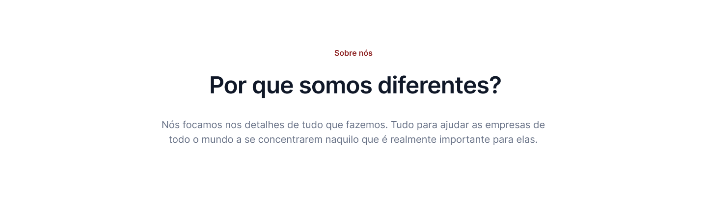
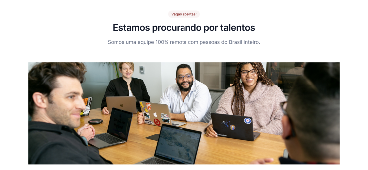
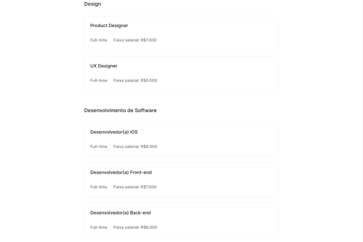
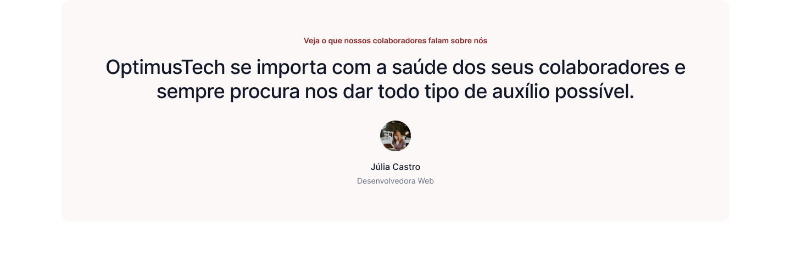

# Desafio 7 Days of Code: HTML5+CSS3
Bom, continuando meus estudos sobre HTML e CSS, que serão tão úteis para as competências da universidade como para minha carreira, resolvi me aventurar no desatio 7 Days of Code da [Giovanna Moeler/GirlCoding](https://github.com/giovannamoeller), onde o desafio é usar meus conhecimentos de HTML e CSS para desenvolver uma página web proposta por ela.

A ideia Inicial, até o momento não é implementar nenhuma funcionalidade, mas sim montar o layout da página

## Escopo do Projeto:
Uma empresa de TI quer desenvolver uma página destinada a novas contratações e contratou você para desenvolvê-la. Foi disponibilizado um layout em Figma e a partir dele vou utiliza-lo para trasnformá-lo em código e dar vida ao mesmo.

## Day01: Cabeçalho

    

No primeiro dia, só foi necessário desenvolver o cabeçalho do site, a barra de navegação(navbar), onde contemplava o logo da empresa, o menu e dois botões de interação no canto direito.

Utilizado os materiais de referência, também disponíveis no [youtube](https://www.youtube.com/watch?v=tWWVgogdr98), consegui entender melhor o conceito de flexbox dentro do CSS, o que era um caos a primeira vista acabou se tornando menos descomplicado. Tentei implementar os conceitos de eixos principais e transversais da melhor forma possível.

## Day02: Primeira Seção

    

Segundo dia: Reproduzir a primeira seção do site mostrada abaixo.

Confesso que ainda me encontro meio perdido no que diz respeito a arquitetura em HTML e CSS, é bem diferente de uma construção de um programa em Java, por exemplo.

De toda forma, o conceito de flexbox ainda ajudou muito a construção do projeto, de forma que utilizei ele pra fazer o resto da página

## Day03: Seção de Métricas

    

Terceiro dia: Implementação da Seção de Métricas de dá página. O conceito de flexbox ajuda muito, mas ainda preciso reforçar bem as tags semânticas em HTMl, pra não querer jogar tudo numa div, fiz alguns exercícios da faculdade assim e é uma atrocidade de ser ler (kkkkkkkk).

## Day 04: Seção com Imagem

Quarto dia: Inserção de Imagens dentro de um seção usando html e css. Curiosamente, depois de entender os conceitos de flexbox, a vida fica um pouco mais fácil e você consegue manipular bem os elementos dentro de uma página.

    

## Day 05: Seção de Vagas
Quinto dia: Acho que pode ter sido a parte mais complicadinha do desafio. Por mais que me foi dado a dica de usar div, acabei utilizando muito o conceito de ul / listas desordenadas (unordered list) e o conceito de dt e dd (Description Lists), por algum motivo fez sentido usar isso no projeto, e confesso que ficou bem legal!

    

## Day 06: Seção de Depoimentos
Sexto dia: Mais um dia que gastei o flexbox no projeto (kkkkkkk), mas gostei muito de praticar, me familiarizar com esse conceito me abre um leque de possibilidades diferentes e me estigou a estudar os outros conceitos de Display!

    

